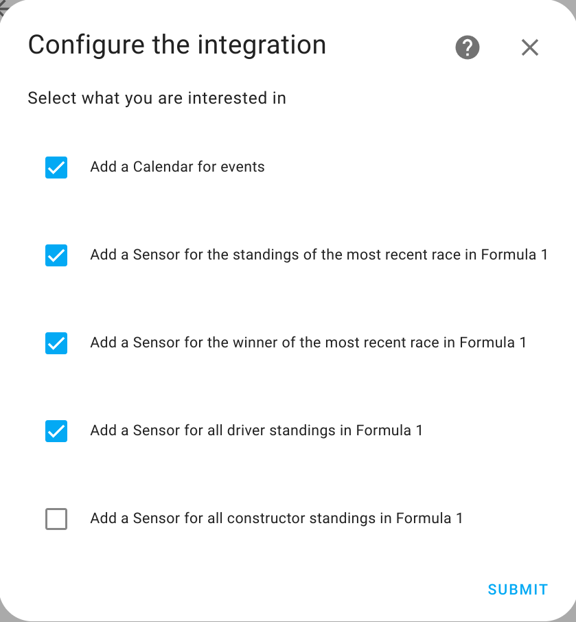

# Formula 1

This is the repository for the integration of Formula 1 for [Home Assistant](https://github.com/Crypthead/core).

<!-- TODO: change to ours
 -->

The Formula 1 integration allows you to automate your own smart devices based on events from Formula 1 race data.

## Configuration

To add the **Formula 1** integration to your Home Assistant instance, use this My button:

Manual configuration steps
If the above My button doesn’t work, you can also perform the following steps manually:

- Browse to your Home Assistant instance.

- Go to Settings > Devices & Services.

- In the bottom right corner, select the  Add Integration button.

- From the list, select Formula 1.

- Select the configurations you'd like to have and press submit

## Calendar
The integration provides a calendar to Home Assistant. You can view all upcoming Formula 1 races in the calendar dashboard.

## Sensors
This integration provides sensors for the following information from Formula 1:

- Driver standings
- Constructor standings
- Standings of the latest race
- Winner of the latest race

## License

Home Assistant is open-source and Apache 2 licensed. Feel free to browse the repository, learn and reuse parts in your own projects.

We use [BrowserStack](https://www.browserstack.com) to test Home Assistant on a large variety of devices.

